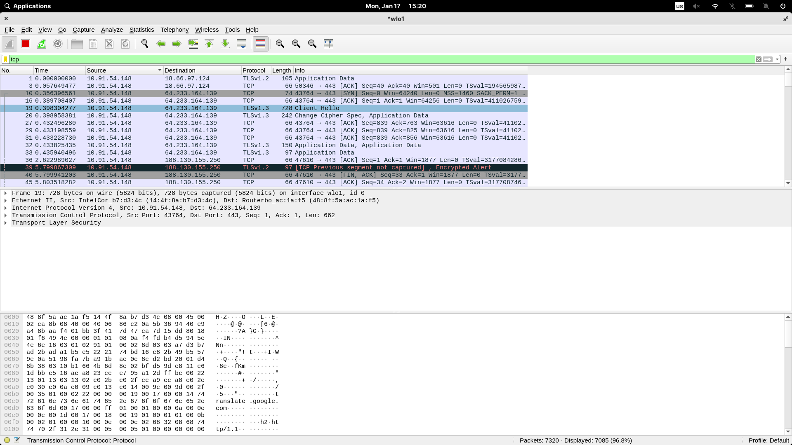
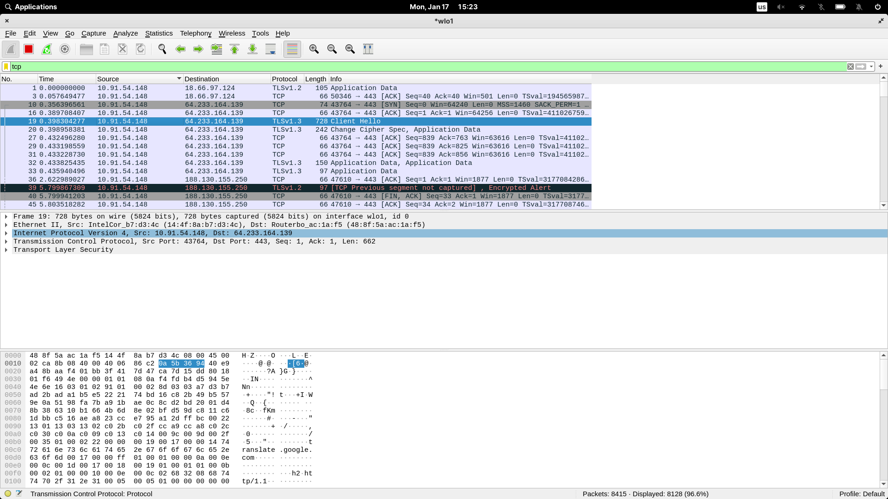
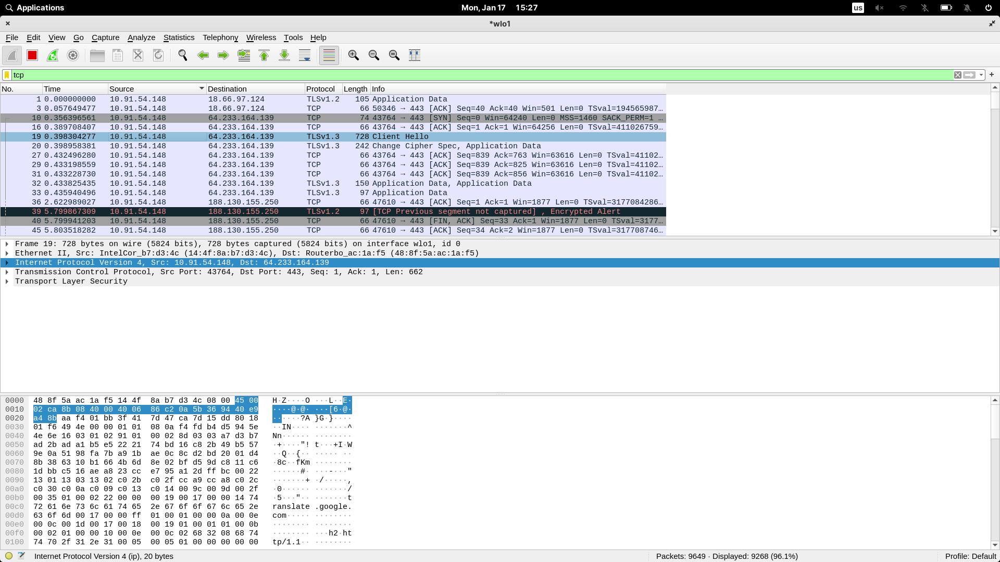
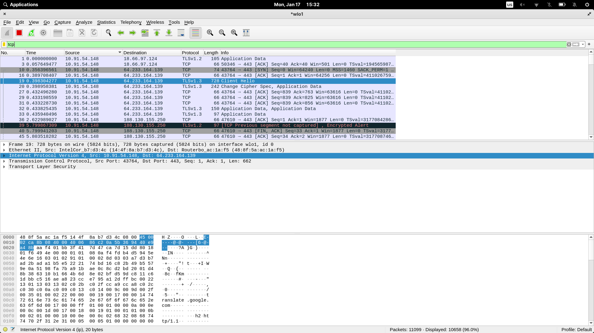
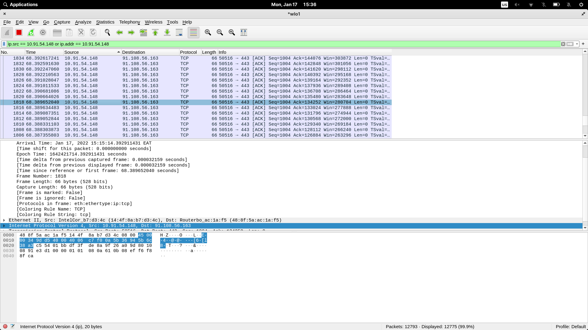

1. __Find some tcp packet received by your laptop and explore it.__

    I found a tcp packet in the list of incoming packets
    
    

1. __Which protocols are used inside the tcp packet?__

    Inside the given packet the following protocols are used 
    
    - Internet Protocol Version 4
    - Transmission Control Protocol
    
    

1. __Who sent this package? What is the ip address and port of source host?__

    The packet was sent by _10.91.54.148_ as is stated besides Internet Protocol Version 4

    The port of the packet is _43764_ as is stated besides Transmission Control Protocol

    

1. __How do we filter out packets containing the tcp protocol?__

    In the upper corner there is a bar where filters can be applied. For example, if only TCP packets are needed, __tcp__ can be typed in that bar.

     
    <!-- 19	0.398304277		64.233.164.139	TLSv1.3	728	Client Hello -->

1. __How do we filter out packets from some specific host?__

    To filter out packets from a specific host, we can write down the following in the filter bar

    > ip.src == 10.91.54.148 or ip.addr == 10.91.54.148

    