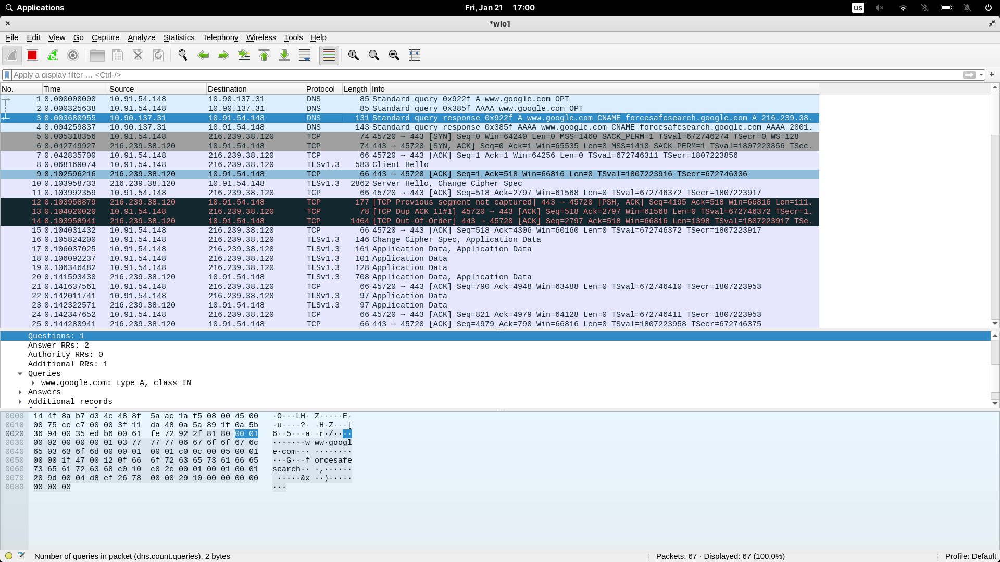

## Task 1


<!-- 8	0.078258932	10.91.54.148	188.184.21.108	HTTP	142	GET / HTTP/1.1  -->

## Task 2

Generally persistent connections make requests in parallel, whereas non-persistent connection make requests one by one.

But in the given example both persistent and non-persistent connections receive similar packages.

The command for persistent connection

``` bash
    $ curl http://info.cern.ch -H "Connection: keep-alive" -H "Keep-Alive: timeout=5, max=100"
```

receives the following packages


The command for non-persistent connection

``` Bash
$ curl http://info.cern.ch -H "Connection: close"
```

receives the following packages


In persistent connection a FIN TCP packet will be received only at the end


In non-persistent connection FIN TCP packet are received in between calls


## Task 3

The command 

``` Bash
$ curl https://www.google.com/
```

did not give any HTML packets. This is because the connection is secure and encrypted

